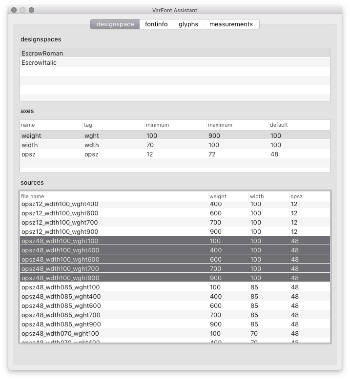
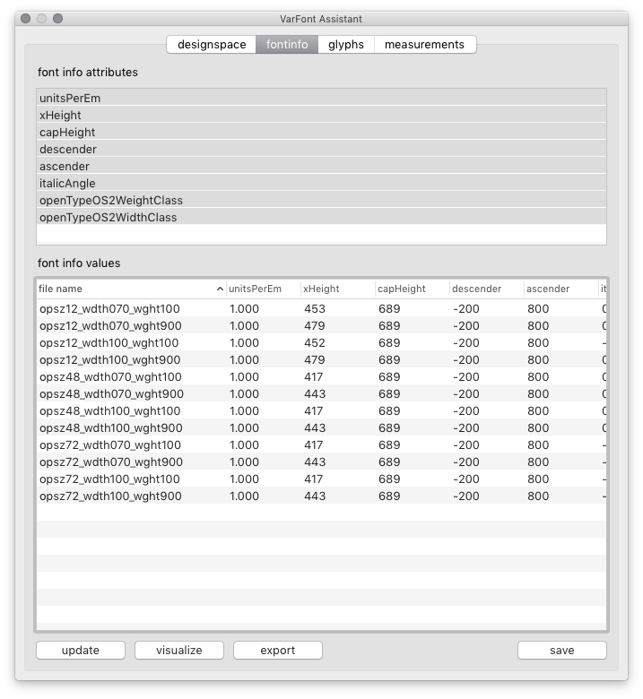
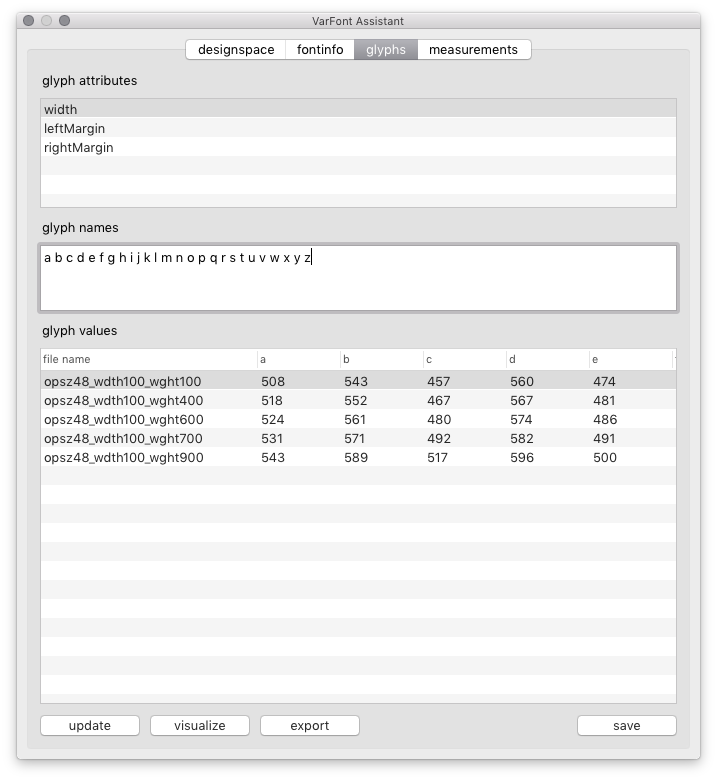
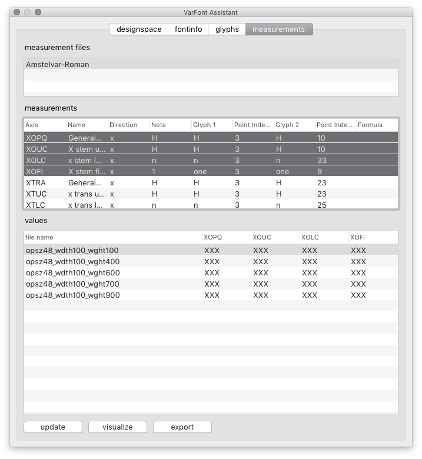
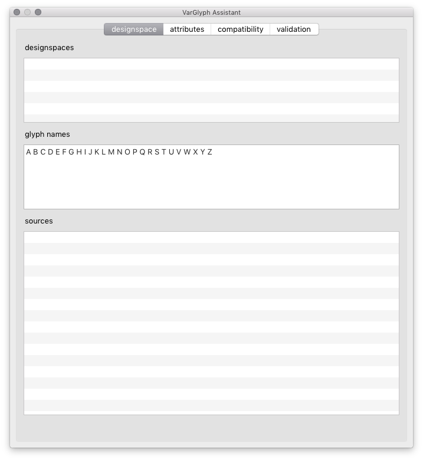
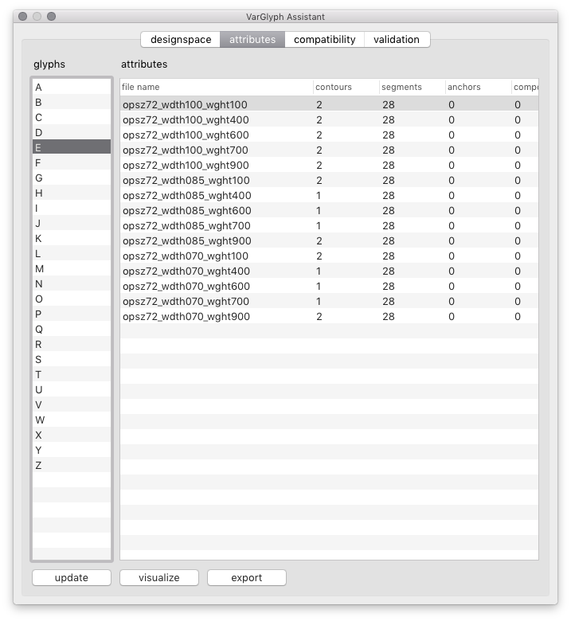
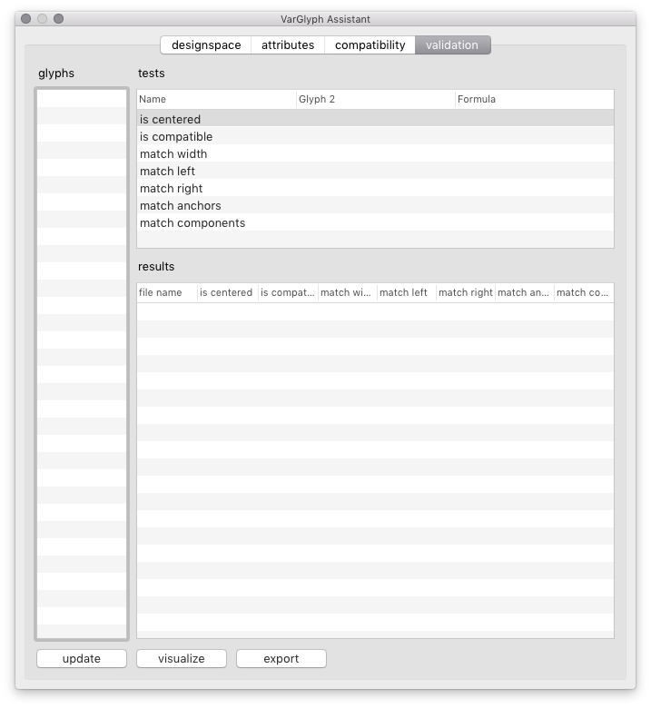
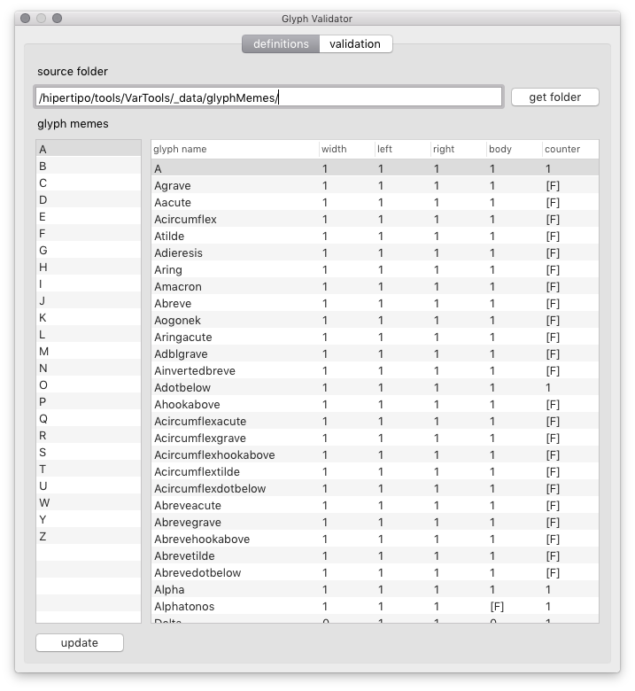
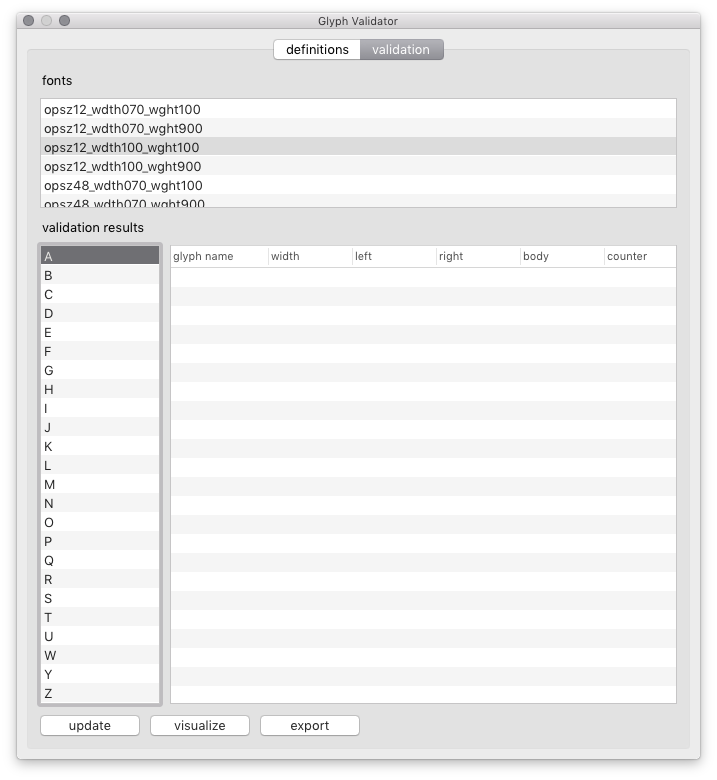

VarTools
========

A new set of tools to assist in the development of variable fonts.

1. VarFont Assistant
2. VarGlyph Assistant
3. Glyph Validator

see also:

4. [TempEdit](http://github.com/gferreira/tempedit)

VarFont Assistant
-----------------

A tool to view and edit font values in designspace sources.

### designspace

Use this tab to define which designspace and fonts sources to look into.

1. Drag one or more `.designspace` files into the first list. The UI will update to show the axes and sources in the designspace.
2. Select sources in which to collect values. Click on the column headers to sort the list using different parameters.

### fontinfo

Use this tab to visualize (and edit) font info values in selected sources.

1. Select which font info attributes to measure.
2. Click the *update* button to scan the fonts, collect values and display them in the UI.
3. Use the *visualize* button to plot the numbers with graphics in PDF format.
4. Use the *export* button to save the table as a CSV file.
5. Edit values in the table and use the *save* button to save them back to the fonts.

### glyphs

Use this tab to visualize (and edit) glyph values in selected sources.

1. Select one glyph attribute to collect values.
2. Type or paste a list of glyph names for value collection.
3. Click the *update* button to scan the fonts, collect values and display them in the UI.
4. Use the *visualize* button to plot the numbers with graphics in PDF format.
5. Use the *export* button to save the table as a CSV file.
6. Edit values in the table and use the *save* button to save them back to the fonts.

### measurements

Use this tab to measure and visualize specific distances in selected sources.

1. Drag one or more `.csv` files with measurement definitions into the fonts. The UI will update to show the various measurement definitions contained in the selected file.
2. Select which measurements to collect values.
3. Click the *update* button to scan the fonts, collect values and display them in the UI.
4. Use the *visualize* button to plot the numbers with graphics in PDF format.
5. Use the *export* button to save the table as a CSV file.

VarGlyph Assistant
------------------

A tool to view and edit glyph data in designspace sources.

### designspace

Use this tab to define which designspace, font sources and glyphs to look into.

1. Drag one or more .designspace files into the first list. The UI will update to show the axes and sources in the designspace.
2. Type or paste a list of glyph names for analysis.
3. Select sources in which to collect values. Click on the column headers to sort the list using different parameters.

### attributes

Use this tab to visualize various glyph values in selected sources.

1. Click the *update* button to scan the fonts, collect values and display them in the UI.
2. Use the *glyphs* column to load current glyph data into the table.
3. Use the *visualize* button to plot the numbers with graphics in PDF format.
4. Use the *export* button to save the table as a CSV file.

### compatibility

Use this tab to check if glyphs from selected sources are compatible for interpolation.

1. Click the *update* button to scan the fonts, collect values and display them in the UI.
2. Use the *glyphs* column to load current glyph data into the table. Line segments are identified by a letter `L`, curve segments are identified by a letter `C`.
3. Use the *visualize* button to plot the numbers with graphics in PDF format.
4. Use the *export* button to save the table as a CSV file.

### validation

Use this tab to perform various tests to glyphs in selected sources.

Glyph Validator
---------------

A tool to check individual fonts for internal consistency in one or more using glyph memes validation.

### definitions

Use this tab to load and edit glyph memes.

1. Choose a folder containing the glyph memes database as `.csv` files.
2. Use the *glyphs* column to update the table with memes for the current glyph.
3. If the `.csv` file contents are changed, use the *update* button to load them all again.

### validation

Use this tab to validate glyphs against the glyph memes.

1. Drag one or more UFO fonts into the horizontal list at the top.
2. Select one font to look into.
3. Click the *update* button to scan the fonts, perform tests, and display the results in the UI.
4. Use the *visualize* button to plot the results with graphics in PDF format.
5. Use the *export* button to save the table as a CSV file.

